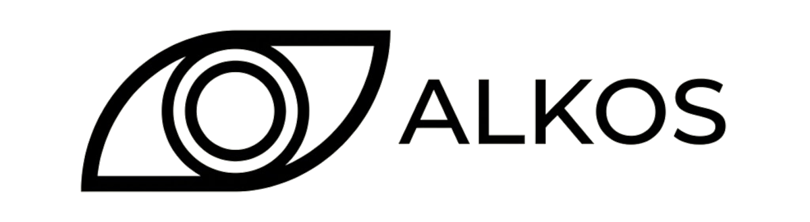
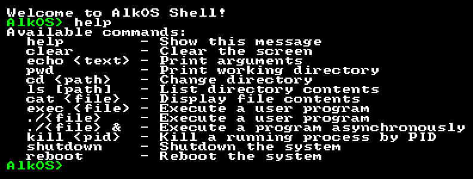

<div align="center">



[](https://github.com/AlkOS-Dev/AlkOS/blob/main/LICENSE)
[](https://github.com/AlkOS-Dev/AlkOS/stargazers)
[](https://github.com/AlkOS-Dev/AlkOS/issues)
[](https://blazeddev.com/)

</div>

AlkOS is a hobby operating system built from the ground up for x86_64. It boots into a
monolithic higher-half kernel, runs its own C library instead of an upstream one, and reaches
a userspace real enough to run DOOM. We share the journey and break down how to build an OS in
plain terms at [blazeddev.com](https://blazeddev.com/).

<div align="center">

</div>

## Building and running

You need Linux (Arch or Ubuntu recommended) or Docker. Dependency installation is automated
for Arch and Ubuntu. The toolchain step builds a dedicated GCC cross-compiler, so the first
run takes a while.

```bash
# Install system dependencies and build the cross-toolchain.
./scripts/alkos_cli.bash --install all

# Generate the build configuration.
./scripts/alkos_cli.bash --configure

# Build the kernel and userspace, make the ISO, boot it in QEMU.
./scripts/alkos_cli.bash --run
```

Run `./scripts/alkos_cli.bash --help` for the full command list. Append `--verbose` to any
command to see the exact error if something breaks.

If everything went right, QEMU drops you into the AlkOS shell:

<div align="center">

</div>

### Tests

```bash
./scripts/actions/build_and_run_tests.bash
./scripts/actions/run_tests.bash
```

## Features

| Capability | Status |
| :--- | :---: |
| 64-bit higher-half kernel (x86_64) | x |
| Physical, virtual, and heap memory management | x |
| Preemptive multitasking and scheduling | x |
| Ring 3 userspace with syscalls and ELF64 loading | x |
| Virtual filesystem with FAT support | x |
| Framebuffer graphics with a window manager | x |
| ACPI and PCI device support | x |
| Running real applications (DOOM) | x |
| Symmetric multiprocessing (SMP) | |
| Networking stack | |
| USB support | |
| Persistent storage and disk drivers | |
| Additional architecture ports (ARM, RISC-V) | |

## License

MIT. See [LICENSE](LICENSE).
